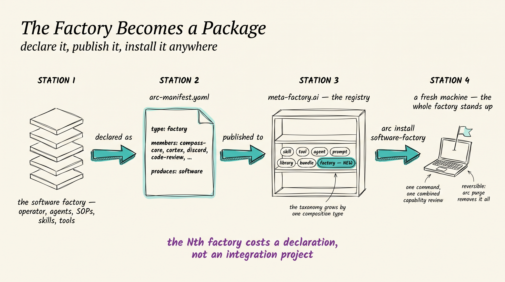
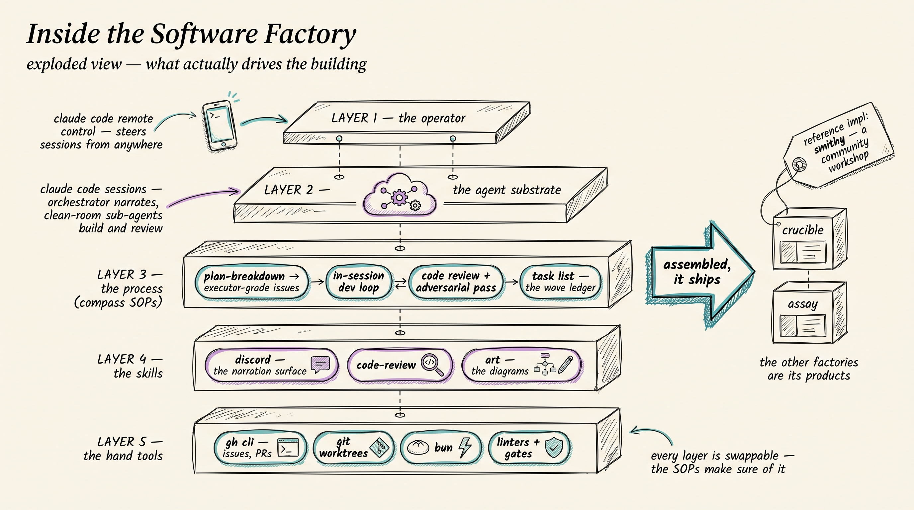

# metafactory-factory-software

The software factory as an installable arc package — the first `type: factory`
composition. The tarball will carry no constituent code: an
`arc-manifest.yaml` whose references point at published members, plus the
tool checks and the `produces: software` capability declaration.

**Status:** working. arc implements the `factory` type
([arc#400](https://github.com/the-metafactory/arc/issues/400) install,
[arc#402](https://github.com/the-metafactory/arc/issues/402) publish
validation), `arc validate .` is clean, and all five members install from one
command — verified 2026-09-02 into an isolated `$HOME`, with the real one
byte-identical before and after. Design (ratified 2026-09-02):
[arc `docs/design-factory-type.md`](https://github.com/the-metafactory/arc/blob/main/docs/design-factory-type.md)
· concept anchor: [arc#365](https://github.com/the-metafactory/arc/issues/365).

## Install

```bash
arc install https://github.com/the-metafactory/metafactory-factory-software
```

One command. arc checks the host tools (`git`, `gh`, `bun`), resolves all five
members, shows **one** combined capability review — the union of every
member's surface, each line attributed to the member that asked for it — and
asks once. Nothing lands until every member has resolved and you have said
yes; one bad member aborts all of it.

`arc install software-factory`, by name, needs the registry. That is HELD
([arc#366](https://github.com/the-metafactory/arc/issues/366) "stock the
shelf"), so members are addressed by git URL for now and the git URL above is
the install path. Flipping to registry names is one line per member.

**What the review shows.** 48 capability lines and `Risk: HIGH (combined)` —
which is a property of the *union*, not of any member: one member reaches the
network, another writes to disk. It also flags that cortex's unrestricted bash
makes the whole composition unrestricted, however careful the other members'
allowlists are. Reading five separate installs would not tell you either
thing. That is what the single review is for.

**Removal is per-member for now.** `arc remove software-factory` takes down
the factory record; the members come down individually. The composition-wide
`files` / `upgrade` / `purge` cascade is
[arc#401](https://github.com/the-metafactory/arc/issues/401), still open.

## The idea



Declare the factory as a manifest, publish it to the registry,
`arc install software-factory` on a fresh machine — one command, one
combined capability review, reversible with `arc purge`. The Nth factory
costs a declaration, not an integration project.

## What's inside (ratified MVP)

Runtime + governance + skills — **no agent bundle**: the agent is the
operator's first choice on top ("fresh machine → factory ready, agent one
install away").

| Member | Pin | Role |
|---|---|---|
| cortex | 6.13.3 | runtime |
| metafactory-cortex-adapter-discord | 0.2.0 | surface |
| compass-core | 0.6.0 | governance — SOPs (plan-breakdown, dev loop, code review) + skills |
| discord (skill) | 0.5.0 | narration surface |
| code-review (skill) | 0.4.2 | the review lane |

Pins are exact by design: a range would reintroduce the integration project
this package type exists to delete. Every pin is cited to its release in the
manifest. Installing cortex also pulls the adapters and renderers it declares
as dependencies — four more packages, all shown in the one review.

Optional tier: pilot-review-loop · art · agent-state · soma · luna-lite.


